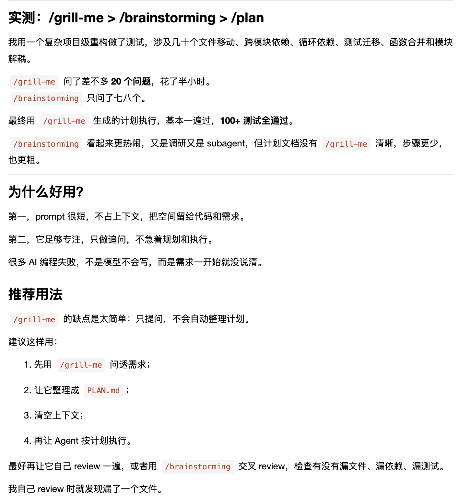
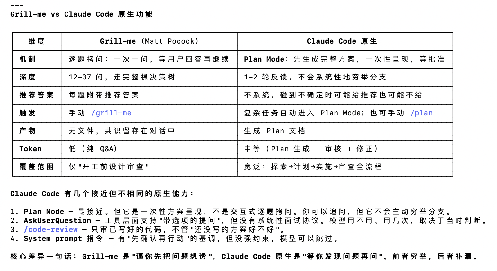
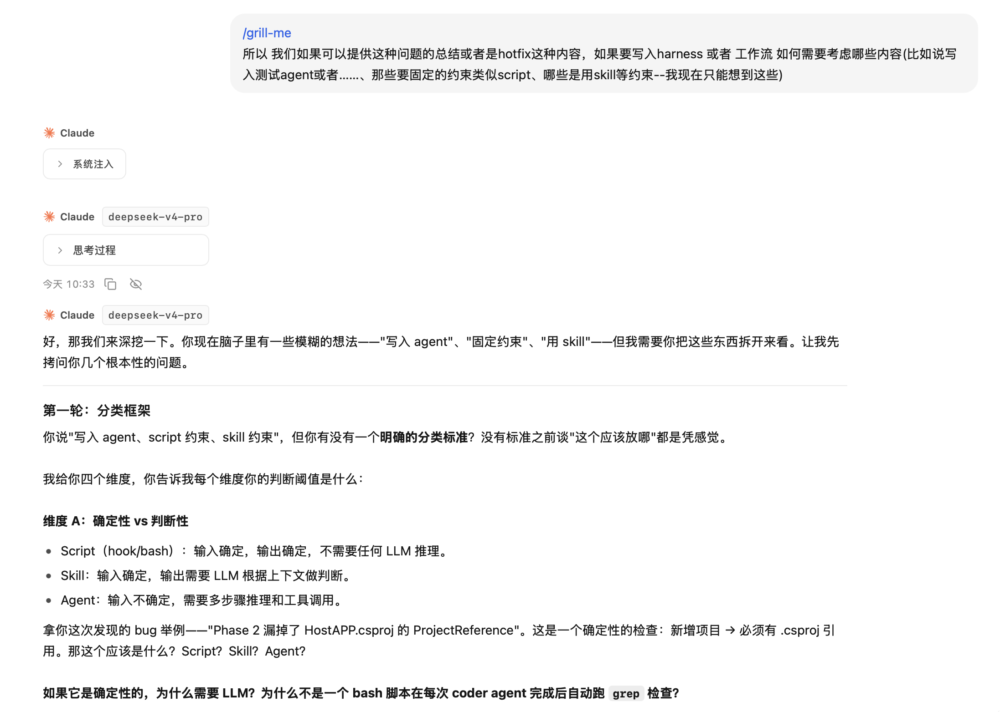
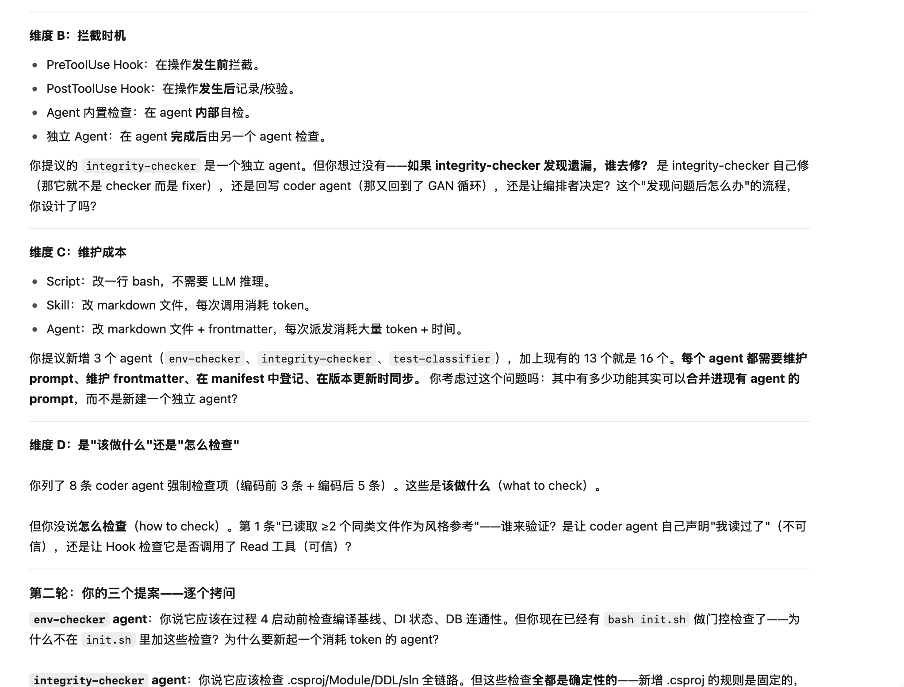
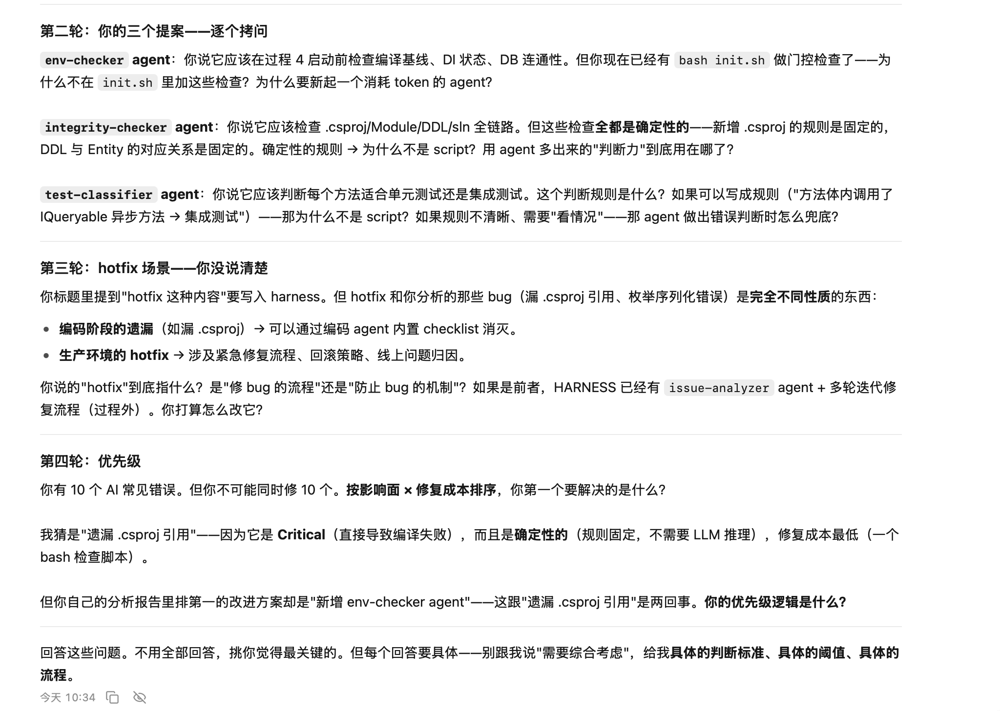
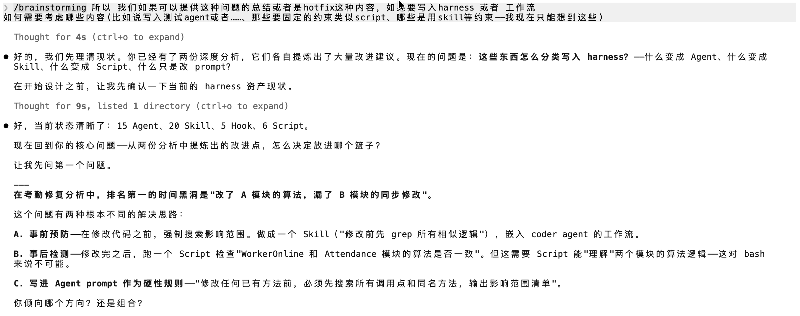
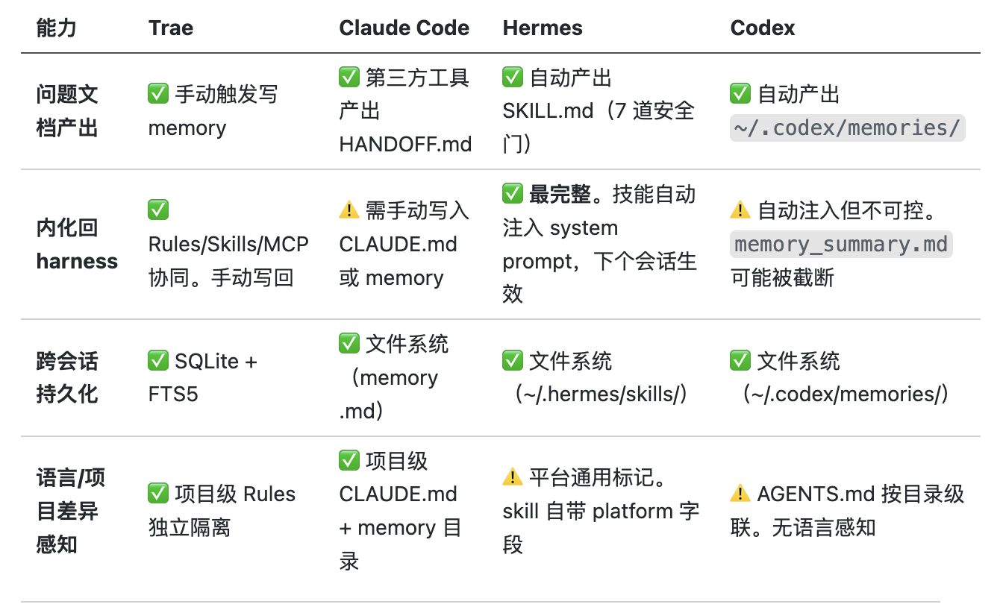
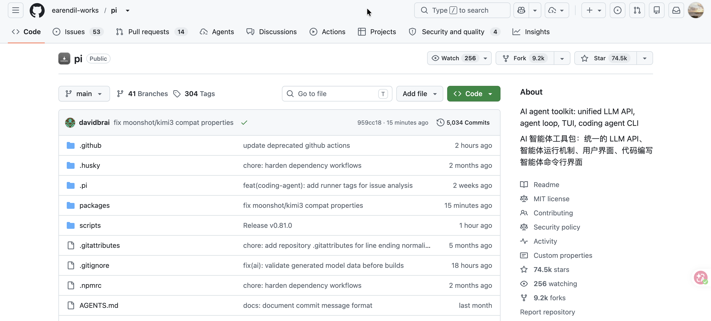

/grill-me /brainstorming下载使用体验

# 日志
- 1.探索cc的使用方法,学习agent
- 2./grill me  /brainstorming的使用
    - grill me 更适合发现问题
    - /brainstorming claudecode 更适合计划解决问题
- 3.工作流程（ai对话）的梳理
    - 3.1 session会话选择extract_qa.py
    - 3.2 session会话分析analyse_sessions.py
    - 3.3 ai：根据llm本质是无状态的语言模型存在的问题： 1)上下文有限（token消耗、RAG、上下文） 2)时校性（mcp）

# 总结个人会话内容
## 人的缺陷与改进（提示词方面）
| # | 问题 | 表现 | 改进建议 |
|---|------|------|---------|
| 1 | **提示词过于简略** | 多次只发一句话甚至几个词（"出入库管理"），缺少文件路径、上下文、期望效果 | **改进**：使用"我要在 [文件路径] 中做 [具体操作]，因为 [原因]，期望结果是 [具体效果]" 的结构化提示词模板。对于概念性问题，附上"我的理解是 X，对吗？" 或者使用trae的提示词优化|
| 2 | **需求前置不足** | 编码完成后才提出批次号区分出入库、noPaging 支持等需求，导致返工修改 | **改进**：在详细设计阶段用 checklist 逐项确认——"还有没有类似的边界场景？""所有字段是否都需要支持全量返回？""编号规则是否需要区分类型？" |
| 3 | **测试配置准备不充分** | 要求测试时没有同时提供 token/ProjectId/服务地址，需要 AI 追问 | **改进**：在启动测试前准备好"测试环境信息卡片"（地址 + token + ProjectId + 时区），作为测试请求的标配附件 |

## AI 的缺陷与常见错误

| # | 问题类型 | 具体表现 | 根因 | 改进方法 |
|---|---------|------|------|---------|
| 1 | **遗漏关键配置** | Phase 2 在 `ModulesLoader.cs` 注册了模块，但漏掉 `HostAPP.csproj` 的 `<ProjectReference>`，导致编译失败（CS0246） | Agent 没有"新增模块 → 必须添加项目引用"的 checklist | **Agent prompt 内置检查清单**：新增模块时强制检查：① `.csproj` 引用 ② `ModulesLoader` 注册 ③ `AppDbContext` DbSet ④ DDL ⑤ `.sln` 包含 |
| 2 | **过度设计** | 批次号生成第一版用了 `ConcurrentDictionary` + 内存缓存，用户质疑后才改为纯 DB 查询（`SELECT MAX` + 直接 +1） | Agent 倾向于"多加一层保障"，但没评估该场景是否真的需要 | **设计决策遵循 YAGNI 原则**：在 Agent prompt 中加入"优先选择最简方案，除非 spec 明确要求或数据量/并发量证明需要缓存" |
| 3 | **对项目全局状态感知不足** | 无法预先判断 DI 生命周期冲突（Singleton→Scoped）、DB 连接池耗尽等问题，只能在启动失败后被动分析 | Agent 在 worktree 隔离环境中编码，无法感知 HostAPP 的整体状态 | **引入"环境健康检查"门控**：在编码前/后自动执行编译检查 + DI 冲突检查 + 数据库连通性检查，作为过程 4 的强制步骤 |

编码经常出现的问题：
- 1.注册类
  - 1.1   HostAPP 找不到 `MaterialSafety` 命名空间。
  - 1.2   sln注册
- 2.时间类（前后端约定）： 
  - 2.1  时间timezone约定，前端传什么后端返回什么
- 3.权限控制
  - 3.1  权限控制：需要单独进行生成
- 4.测试（单元测试和集成测试）
运行经常出现的问题：
1.DI 生命周期冲突、DB 连接池耗尽、PeriodicTimer 异常、端口占用（服务启动失败 → 人贴日志 → AI 分析根因）

问题这种前后端的约束是否需要更新写入 harness，作为什么规范如何写入
是否需要迭代一个项目开发文档包括 对这个项目进行模块间联系详细介绍（横向纵向）

# 思路
| 问题 ｜实践 <=> 论文/工程调研｜
ai与人多轮对话（模型记忆） -> 从实践中吸取教训迭代更新（？）<=> ai-agent 自进化的论文与工程实践 <参考（codex、claude code）> 

# 相关资料
参考（codex、claude code）会话记录：

# 设想： 数据预处理 - agent模型 - 训练方法 - 评估标准 
## 数据来源：
1.运行harness，调用脚本会话自动总结会话内容，总结成问题文档
2.针对提交的hotfix修改comment，总结成问题文档

## Agent训练：
┌─────────────────────────────────────────────────────────────────────┐
│                        数据来源层                                    │
│  对话日志 · 工具调用轨迹 · 用户纠正 · 评测分数 · 人类标注            │
└──────────────────────────────┬──────────────────────────────────────┘
                               ▼
┌─────────────────────────────────────────────────────────────────────┐
│                        捕获层 (Capture)                              │
│  Hook 自动截获 · 会话结束触发 · 后台静默写入                         │
│  Claude Code: SessionStart/Stop hooks → memory 文件                  │
│  Codex: 后台自动摘要 → ~/.codex/memories/                           │
│  第三方: CogniKernel / YesMem / MKG 的 lifecycle hooks              │
└──────────────────────────────┬──────────────────────────────────────┘
                               ▼
┌─────────────────────────────────────────────────────────────────────┐
│                      反思提取层 (Reflection)                          │
│  从原始轨迹中提取结构化经验                                          │
│  Retroformer: skills · failures · policies · observations (JSON)    │
│  LangChain Insights Agent: 聚类 traces → 失败模式                    │
│  Armada: agent_lessons 表 + 评分                                    │
│  SkillLoop: 确定性评测 → 记忆/技能提案                               │
└──────────────────────────────┬──────────────────────────────────────┘
                               ▼
┌─────────────────────────────────────────────────────────────────────┐
│                       整合层 (Consolidation)                         │
│  去噪 · 合并 · 泛化 · 锻造                                           │
│  memory-forge: ≥7天老化过滤 → 语义聚类 → 生成 umbrella skill        │
│  ≥3次重复触发整合 · origin-hash 保护人工编辑 · 90天衰减              │
└──────────────────────────────┬──────────────────────────────────────┘
                               ▼
┌─────────────────────────────────────────────────────────────────────┐
│                        产出层 (Output)                               │
│  ┌──────────┬──────────┬──────────┬──────────┬──────────┐          │
│  │ Memory   │ Skill    │ Prompt   │ Script   │ 训练数据  │          │
│  │ .md 文件  │ SKILL.md │ 系统提示词│ 工具/扩展 │ 微调导出  │          │
│  └──────────┴──────────┴──────────┴──────────┴──────────┘          │
└──────────────────────────────┬──────────────────────────────────────┘
                               ▼
┌─────────────────────────────────────────────────────────────────────┐
│                       注入层 (Re-injection)                          │
│  会话开始前 · 会话进行中 · 提示词级 · 技能级                          │
│  replay-learnings 简报 · CLAUDE.md 加载 · 工具调用检索               │
│  EvolveClaw 直接注入 system prompt · PromptCompiler 重写提示词       │
└──────────────────────────────┬──────────────────────────────────────┘
                               ▼
┌─────────────────────────────────────────────────────────────────────┐
│                       安全门 (Safety Gate)                           │
│  人类审批(PR) · 验证门控 · 老化过滤 · 漂移检测 · A/B测试            │
└─────────────────────────────────────────────────────────────────────┘

# 问题：
1.harness 本质是基于 上下文、工具（mcp等）扩展，agent自进化类似于GRPO，会不会存在过拟合问题（即过多skill和约束导致运行受限）？
    搜索结论：
        1.在llm基座模型很弱情况下会存在无法扩散
        2.对于deepseek等商用api模型，扩散能力很强，一般不会存在过多的约束导致性能下降
2.问题文档 如何 转化成harness(agent)的训练数据
    
    

# ⭐️下一步做什么：
1.探索一下pi从零开始的agent
2.harness关于进化（自己迭代）插件
3.总结trea主流模型对于进化的实现方式

参考资料
1.https://forum.trae.cn/t/topic/13529

https://github.com/earendil-works/pi
https://pi.dev/